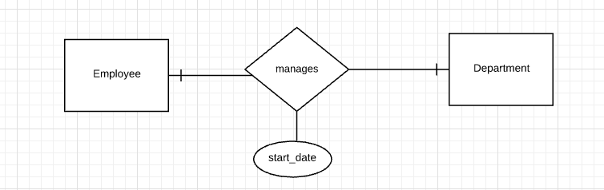

<h1>DBMS</h1>

<h2>Three Tier Architecture</h2>

<ol>
    <li>Presentation Layer</li>
    <li>Application Layer</li>
    <li>Data Layer</li>
</ol>

<p>
DB lies the third, lowest layer in the architecture.
</p>

<h2>Database Design Phases</h2>

<ol>
    <li><a href="#analysis">Requirements Collection & analysis phase</a></li>
    <li><a href="#conceptual">Conceptual Design (ERD's)</a></li>
    <li><a href="#logical">Logical Design (Mapping)</a></li>
    <li><a href="#physical">Physical Design</a></li>
</ol>

<div id="analysis">
<h2>1.Requirements Collection & analysis phase</h2> 
<p>
     two types of requirements
    <ol>
        <li>Functional</li>
        <li>Data - Employee number, address, name, etc.</li>
    </ol>
     
</p>
</div>

<div id="conceptual">
<h2>2.Conceptual Design (ERD's)</h2>

```
here is the the EERD for nansoft EP management system
```


<h3>Entities</h3>

<p>
    <ul>
    <li>there are 4 main entities</li>
    <ol>
        <li> Person</li>
        <li> Customer, which is specification of Person </li>
        <li> Employee, which is specification of Person </li>
        <li>Project</li>
    </ol>
    <li>Person has composite attribute: name</li>
    <li>primary key for customer is customer_id</li>
    <li>primary key for Customer is customer_id</li>
    <li>primary key for Employee is ssn</li>
    <li>primary key for Project is project_id</li>
    <li>Project has a multi valued attribute project type</li>
    </ul>

</p>

<h3>Relationships</h3>

<p>
    <ul>
    <li>Customer and Employee are specification of Person with total & disjoint constraints</li>
    <li>Employee,Project:n:m relationship
        <ul>
            <li>One Employee can work on 0 or many projects  ( o or many symbol on the Project side )</li>
             <li>One Project can have 0 or many Employee  ( o or many symbol on the Employee side )</li>
        </ul>
    </li>
    <li>Customer,Project:1:m relationship
        <ul>
            <li>One Customer can own on 1 or many projects  ( 1 or many symbol on the Project side )</li>
             <li>One Project can have only one customer  ( one and only one symbol on the Customer side )</li>
        </ul>
    </li>
    <li>Employee has a recursive relationship for leadership :1:n</li>
    <li>Dependent is a week entity which is related with Employee</li>
    </ul>

   <p> <span style="color:blue">Note: </span>
   There are 2 types of constraints:
   Completeness (total/partial) and 
    Overlap/Disjoint


</p>
</div>

<div id="logical">
<h2>3.Logical Design (Mapping)</h2>

<h3>Mapping the current E-ERD</h3>
<ol>
     <!-- step 1 -->
    <li><h4>STEP  1</h4>
     <b> map strong entities</b><br>
    map strong entities with attributes
    <P>we need to discard multi value and derived attributes in ths phase.
    <!-- Person table -->
    <div>
    <h6>Person</h6>
    <table>
        <th><u>SSN</ul></th>
        <th>DOB</th>
        <th>first_name</th>
        <th>middle_name</th>
        <th>last_name</th>
    </table>
    </p>
    </div>
    <!-- Customer table -->
    <div>
    <h6>Customer</h6>
    <table>
        <th><u>c_id</ul></th>
        <th>loyalty</th>
    </table>
    </p>
    </div>
      <!-- Employee table -->
    <div>
    <h6>Employee</h6>
    <table>
        <th><u>e_id</ul></th>
        <th>salary</th>
    </table>
    </p>
    </div>
        <!-- Project table -->
    <div>
    <h6>Project</h6>
    <table>
        <th><u>p_id</ul></th>
    </table>
    </p>
    </div>
    </li>
     <!-- step 2 -->
    <li><h4>STEP 2</h4><b> map week entities</b><br>
    <p>week entities will be given a separate relation with partial key of week entity and primary key of strong entity being the new primary key of the relation </p>
      <!-- Dependent table -->
    <div>
    <h6>Dependent</h6>
    <table>
        <th><u>e_id</ul></th>
         <th><u>name</ul></th>
        <th>sex</th>
    </table>
    </p>
    </div>
    </li>
    <!-- step 3 -->
    <li><h4>STEP 3</h4><b> map 1:1 relationships</b><br>
    <p>Choose one of the relations and include its primary key
as foreign key of the other relation. It is better to
choose an entity type with total participation to add foreign key field. since this  example has no 1:1 relationships, we will look at a different example.
<br>



<!-- Employee table -->
<div>
    <h6>Employee</h6>
    <table>
        <th><u>e_id</ul></th>
         <th>salary</th>
        <th>sex</th>
    </table>
</div>
<!-- Employee table -->
<div>
    <h6>Department</h6>
    <table>
        <th><u>dno</ul></th>
         <th>name</th>
        <th><span style="border-bottom: 1px black dashed;">manger_id</span></th>
        <th>start_date</th>
    </table>
</div>
 <!-- step 4 -->
    <li><h4>STEP 4</h4><b> map 1:n relationships</b><br>
    <p>the primary key of one side relation will be used in the many side as a foreign key. Also relationships attributes will go to the many side.
         <!-- Project table -->
    <div>
    <h6>Project</h6>
    <table>
        <th><u>p_id</ul></th>
        <th><span style="border-bottom: 1px black dashed;">c_id</span></th>
        <th>assign_date</th>
    </table>
    </div>
          <!-- Employee table -->
    <div>
    <h6>Employee</h6>
    <table>
        <th><u>e_id</ul></th>
        <th>salary</th>
        <th><span style="border-bottom: 1px black dashed;">super_e_id</span></th>
    </table>
    </p>
    </div>
    </p>
    </li>
     <!-- step 5 -->
    <li><h4>STEP 5</h4><b> map n:m relationships</b><br>
    <p>a separate relation will be used. The new PK will be two primary keys.
     <!-- Employee-project table -->
    <div>
    <h6>Employee-project</h6>
    <table>
        <th><u>e_id</ul></th>
        <th><u>p_id</ul></th>
        <th>work_hours</th>
    </table>
    </div>
    </p>
    </li>
      <!-- step 6 -->
     <li><h4>STEP 6</h4><b> map multi valued attributes</b><br>
    <p>a separate relation will be used. The new PK will be the primary keys of entity and the attribute itself.
    <!-- Project_type -->
    <div>
    <h6>Project_type</h6>
    <table>
        <th><u>p_id</ul></th>
        <th><u>project_type</ul></th>
    </table>
    </div>
    </p>
    </li>
      <!-- step 7 -->
     <li><h4>STEP 7</h4><b> map n-nary relationships</b><br>
    <p>Just like n:m mapping relationships we take a separate relation. The new PK will be n PKs of the strong entities. Any relationship attributes will also be in the relation.
    </p>
    </li>
      <!-- step 8 -->
     <li><h4>STEP 8</h4><b> map specification and generalization</b><br>
    <p>There are 4 ways to map inheritance in EER Diagrams.
        <ol>
               <!-- step 8 option 1 -->
            <li><b>Option 1 -</b> (total/partial, disjoint/overlap)
                <p>Have a super class relation with all the super class attributes. And for each subclass a relation which includes the primary key of
the super class and the attributes of the subclass. </p>
             <p> <span style="color:blue">Note: </span>
  This is the most flexible option because it suits any type and support the requirement changes in future.</p>
   <!-- Person table -->
    <div>
    <h6>Person</h6>
    <table>
        <th><u>SSN</ul></th>
        <th>DOB</th>
        <th>first_name</th>
        <th>middle_name</th>
        <th>last_name</th>
    </table>
    </p>
    </div>
    <!-- Customer table -->
    <div>
    <h6>Customer</h6>
    <table>
         <th><u>SSN</ul></th>
        <th>loyalty</th>
    </table>
    </p>
    </div>
      <!-- Employee table -->
    <div>
    <h6>Employee</h6>
    <table>
       <th><u>SSN</ul></th>
        <th>salary</th>
          <th><span style="border-bottom: 1px black dashed;">super_e_ssn</span></th>
    </table>
    </p>
    </div>
        <!-- Project table -->
    <div>
    <h6>Project</h6>
    <table>
        <th><u>p_id</ul></th>
         <th><span style="border-bottom: 1px black dashed;">c_ssn</span></th>
        <th>assign_date</th>
    </table>
    </p>
    </div>
     <!-- Dependent table -->
     <div>
    <h6>Dependent</h6>
    <table>
        <th><u>SSN</ul></th>
         <th><u>name</ul></th>
        <th>sex</th>
    </table>
    </p>
    </div>
     <!-- Employee-project table -->
    <div>
    <h6>Employee-project</h6>
    <table>
        <th><u>e_ssn</ul></th>
        <th><u>p_id</ul></th>
        <th>work_hours</th>
    </table>
    </div>
     <!-- Project_type -->
    <div>
    <h6>Project_type</h6>
    <table>
        <th><u>p_id</ul></th>
        <th><u>project_type</ul></th>
    </table>
    </div>
            </li>
     <!-- step 8 option 2 -->
     <li><b>Option 2 -</b> (total)
                <p>In our case this can be applied. But it won't cope with the changes to the total constraint in the future. In this option there will be no superclass relation because any type will belong to either one of subclasses. So all the attributes in superclass will be present in each subclass.</p>
    <!-- Customer table -->
    <div>
    <h6>Customer</h6>
    <table>
         <th><u>SSN</ul></th>
          <th>DOB</th>
        <th>first_name</th>
        <th>middle_name</th>
        <th>last_name</th>
        <th>loyalty</th>
    </table>
    </p>
    </div>
      <!-- Employee table -->
    <div>
    <h6>Employee</h6>
    <table>
       <th><u>SSN</ul></th>
        <th>DOB</th>
        <th>first_name</th>
        <th>middle_name</th>
        <th>last_name</th>
        <th>salary</th>
          <th><span style="border-bottom: 1px black dashed;">super_e_ssn</span></th>
    </table>
    </p>
    </div>
        <!-- Project table -->
    <div>
    <h6>Project</h6>
    <table>
        <th><u>p_id</ul></th>
         <th><span style="border-bottom: 1px black dashed;">c_ssn</span></th>
        <th>assign_date</th>
    </table>
    </p>
    </div>
     <!-- Dependent table -->
     <div>
    <h6>Dependent</h6>
    <table>
        <th><u>SSN</ul></th>
         <th><u>name</ul></th>
        <th>sex</th>
    </table>
    </p>
    </div>
     <!-- Employee-project table -->
    <div>
    <h6>Employee-project</h6>
    <table>
        <th><u>e_ssn</ul></th>
        <th><u>p_id</ul></th>
        <th>work_hours</th>
    </table>
    </div>
     <!-- Project_type -->
    <div>
    <h6>Project_type</h6>
    <table>
        <th><u>p_id</ul></th>
        <th><u>project_type</ul></th>
    </table>
    </div>
    </li>
     <!-- step 8 option 3 -->
    <li><b>Option 3 -</b> (disjoint)
                <p>Only one relation. There will be a extra attribute to represent which subclass the record belongs to.This is suitable for both total and partial as long as it's disjoint.</p>
     <!-- Person table -->
    <div>
    <h6>Person</h6>
    <table>
        <th><u>SSN</ul></th>
        <th>DOB</th>
        <th>first_name</th>
        <th>middle_name</th>
        <th>last_name</th>
        <th>sub_type</th>
        <th>loyalty</th>
        <th>salary</th>
          <th><span style="border-bottom: 1px black dashed;">super_e_ssn</span></th>
    </table>
    </p>
    </div>
    <!-- Project table -->
    <div>
    <h6>Project</h6>
    <table>
        <th><u>p_id</ul></th>
         <th><span style="border-bottom: 1px black dashed;">c_ssn</span></th>
        <th>assign_date</th>
    </table>
    </p>
    </div>
     <!-- Dependent table -->
     <div>
    <h6>Dependent</h6>
    <table>
        <th><u>SSN</ul></th>
         <th><u>name</ul></th>
        <th>sex</th>
    </table>
    </p>
    </div>
     <!-- Employee-project table -->
    <div>
    <h6>Employee-project</h6>
    <table>
        <th><u>e_ssn</ul></th>
        <th><u>p_id</ul></th>
        <th>work_hours</th>
    </table>
    </div>
     <!-- Project_type -->
    <div>
    <h6>Project_type</h6>
    <table>
        <th><u>p_id</ul></th>
        <th><u>project_type</ul></th>
    </table>
    </div>
    </li>
     <!-- step 8 option 4 -->
    <li><b>Option 4 -</b> (overlap)
                <p>Only one relation. There will be flags (boolean attribute) for each subclass type to represent which subclass the record belongs to.This is suitable for both total and partial as long as it's a overlap. If there a disjoints there will be null values.</p>
     <!-- Person table -->
    <div>
    <h6>Person</h6>
    <table>
        <th><u>SSN</ul></th>
        <th>DOB</th>
        <th>first_name</th>
        <th>middle_name</th>
        <th>last_name</th>
        <th>CFlag</th>
        <th>loyalty</th>
         <th>EFlag</th>
        <th>salary</th>
          <th><span style="border-bottom: 1px black dashed;">super_e_ssn</span></th>
    </table>
    </p>
    </div>
    <!-- Project table -->
    <div>
    <h6>Project</h6>
    <table>
        <th><u>p_id</ul></th>
         <th><span style="border-bottom: 1px black dashed;">c_ssn</span></th>
        <th>assign_date</th>
    </table>
    </p>
    </div>
     <!-- Dependent table -->
     <div>
    <h6>Dependent</h6>
    <table>
        <th><u>SSN</ul></th>
         <th><u>name</ul></th>
        <th>sex</th>
    </table>
    </p>
    </div>
     <!-- Employee-project table -->
    <div>
    <h6>Employee-project</h6>
    <table>
        <th><u>e_ssn</ul></th>
        <th><u>p_id</ul></th>
        <th>work_hours</th>
    </table>
    </div>
     <!-- Project_type -->
    <div>
    <h6>Project_type</h6>
    <table>
        <th><u>p_id</ul></th>
        <th><u>project_type</ul></th>
    </table>
    </div>
    </li>
        </ol>
    </p>
      <!-- step 9 -->
    <li><h4>STEP 9</h4><b> map union types</b><br>
    <p></p>
    </li>
</ol>

</div>

<div id="physical">
<h2>4.Physical Design</h2> 
</div>
